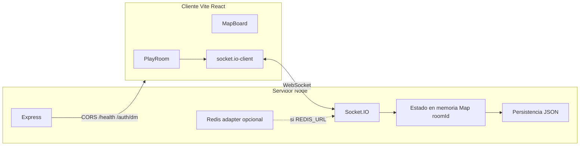

# Arquitectura

- **Estado de juego**: un `RoomState` por sala en el proceso del servidor; se serializa a disco de forma debounced tras mutaciones relevantes.
- **DM**: autenticación por `dmKey` (desarrollo) o `dmToken` JWT (`POST /auth/dm`).
- **Jugadores**: `playerSessionId` persistente en `localStorage` para reclamar el mismo PC al reconectar.

## Carpetas clave

| Ruta                            | Rol                                      |
| ------------------------------- | ---------------------------------------- |
| `client/src/pages/PlayRoom.tsx` | Orquestación de la sala                  |
| `client/src/hooks/playroom/`    | Socket, FX de dados, intercambio JWT DM  |
| `server/src/index.ts`           | HTTP + Socket.IO + carga de snapshot     |
| `server/src/room-broadcast.ts`  | Emisión de `roomState` con `roomVersion` |
| `server/src/persistence.ts`     | Guardado/carga JSON                      |
| `server/src/redis-adapter.ts`   | Adapter Redis para Socket.IO (opcional)  |
